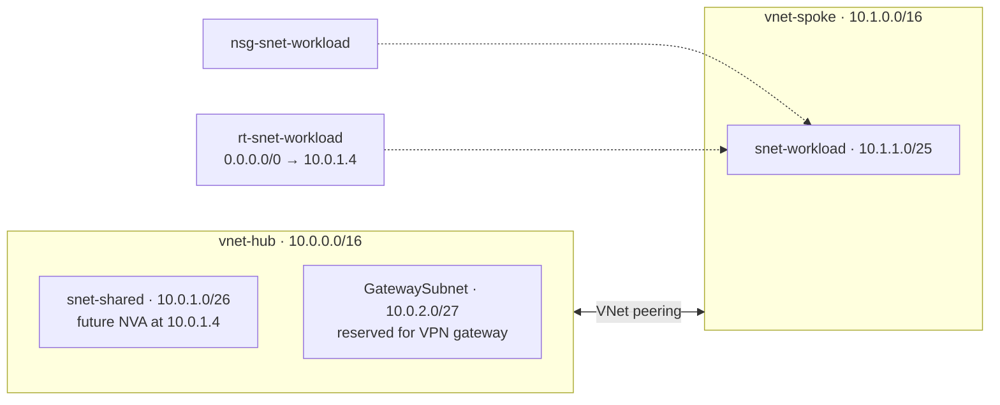

# Azure Hub-and-Spoke Network (Bicep)

A hub-and-spoke virtual network topology on Microsoft Azure, deployed entirely as Infrastructure as Code with Bicep. Built as a hands-on project while studying for the **AZ-104: Microsoft Azure Administrator** certification.

## Problem It Solves

As organizations grow in Azure, putting every workload in one flat network becomes hard to secure and manage. The hub-and-spoke model solves this by:

- Centralizing shared services (VPN gateway, firewall, DNS) in a single **hub** so they're deployed and paid for once
- Isolating workloads in separate **spokes** that connect only to the hub
- Enforcing security and traffic inspection in one place

This project builds that foundation with least-privilege network security and forced routing through the hub.

## Architecture



### Address Plan

| VNet | Address space | Subnet | Prefix | Usable IPs |
|---|---|---|---|---|
| vnet-hub | 10.0.0.0/16 | snet-shared | 10.0.1.0/26 | 59 |
| vnet-hub | 10.0.0.0/16 | GatewaySubnet | 10.0.2.0/27 | 27 |
| vnet-spoke | 10.1.0.0/16 | snet-workload | 10.1.1.0/25 | 123 |

Usable IPs account for the 5 addresses Azure reserves in every subnet. Address spaces don't overlap, which VNet peering requires, and 10.2.0.0/16 onward is left open for future spokes.

## Resources Deployed

| Resource | Name | Purpose |
|---|---|---|
| Virtual network | `vnet-hub` | Hub for shared services |
| Virtual network | `vnet-spoke` | Isolated workload network |
| VNet peering (x2) | `peer-hub-to-spoke`, `peer-spoke-to-hub` | Bidirectional connectivity (peering is one-way per resource) |
| Network security group | `nsg-snet-workload` | Least-privilege inbound rules on the workload subnet |
| Route table | `rt-snet-workload` | Forces spoke egress through the hub |

## Security Design

The workload subnet NSG allows only what's needed and explicitly overrides Azure's default `AllowVnetInBound` rule. That default rule would otherwise allow **all** traffic from the peered hub.

| Priority | Rule | Source | Port | Action |
|---|---|---|---|---|
| 100 | Allow-HTTPS-From-Hub | 10.0.0.0/16 | 443 | Allow |
| 110 | Allow-Mgmt-From-Shared | 10.0.1.0/26 | 22, 3389 | Allow |
| 4000 | Deny-VNet-Inbound | VirtualNetwork | Any | Deny |

## Routing Design

A user-defined route sends all spoke egress (`0.0.0.0/0`) to `10.0.1.4` in the hub, where a firewall or network virtual appliance (NVA) would inspect traffic. The peering route to the hub is more specific than `0.0.0.0/0`, so hub traffic still flows directly. This is the pattern enterprises use for centralized inspection and for enabling spoke-to-spoke communication, since peering is not transitive.

> **Note:** No NVA is deployed, to keep costs at $0. The route shows the design intent.

## Cost Controls

Guardrails were put in place **before** deploying anything:

- **Budget:** $10/month with alerts at 50% and 80% actual spend and 100% forecasted spend
- **Azure Policy:** The built-in *Not allowed resource types* policy, assigned at subscription scope with a Deny effect, blocks expensive resources such as VPN gateways, Azure Firewall, Bastion, NAT gateways, Application Gateway, ExpressRoute, and DDoS Protection plans. It was tested by attempting to create a NAT gateway, which was correctly rejected with `RequestDisallowedByPolicy`.

**Total running cost of this project: $0.** VNets, subnets, NSGs, route tables, and peering with no traffic are free.

## Deploy It Yourself

**Prerequisites:** Azure subscription, [Azure CLI](https://learn.microsoft.com/cli/azure/install-azure-cli), and Bicep (`az bicep install`).

```bash
# Sign in
az login

# Create the resource group
az group create --name rg-hubspoke-lab --location eastus

# Preview changes
az deployment group what-if --resource-group rg-hubspoke-lab --template-file main.bicep

# Deploy
az deployment group create --resource-group rg-hubspoke-lab --template-file main.bicep
```

### Verify

```bash
# Peering should show Connected / FullyInSync
az network vnet peering list -g rg-hubspoke-lab --vnet-name vnet-hub -o table

# NSG rules
az network nsg rule list -g rg-hubspoke-lab --nsg-name nsg-snet-workload -o table

# Route table
az network route-table route list -g rg-hubspoke-lab --route-table-name rt-snet-workload -o table
```

### Clean Up

```bash
az group delete --name rg-hubspoke-lab --yes --no-wait
```

## AZ-104 Exam Objectives Covered

| Domain | Objective |
|---|---|
| Implement and manage virtual networking | Create and configure virtual networks and subnets |
| Implement and manage virtual networking | Create and configure virtual network peering |
| Implement and manage virtual networking | Configure user-defined network routes |
| Implement and manage virtual networking | Create and configure network security groups; evaluate effective security rules |
| Deploy and manage Azure compute resources | Interpret, modify, and deploy Bicep files |
| Manage Azure identities and governance | Implement and manage Azure Policy |
| Manage Azure identities and governance | Manage costs by using alerts and budgets |

## What I Learned

- **Address planning comes first.** Peered VNets can't have overlapping address spaces, and a subnet's range can't be changed while resources are deployed in it.
- **Peering is one-way per resource.** Each side needs its own peering, or the state stays *Initiated*. Peering is also **not transitive**: two spokes peered to the same hub can't reach each other without direct peering or routing through an NVA.
- **Azure's default NSG rules include peered VNets** in the `VirtualNetwork` service tag, so least-privilege access requires an explicit deny rule.
- **Budgets alert; policies prevent.** On a pay-as-you-go subscription with no spending limit, Azure Policy is what actually stops costly deployments.
- **Incremental deployment mode** updates only what's in the template and leaves everything else alone, and `what-if` previews changes before they happen.

## Future Improvements

- Parameterize address prefixes and split resources into Bicep modules
- Add a second spoke to demonstrate spoke-to-spoke routing through the hub
- Add a GitHub Actions workflow that runs `what-if` on pull requests