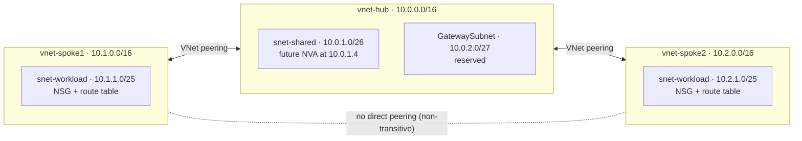

# Azure Hub-and-Spoke Network (Bicep)

A hub-and-spoke virtual network topology on Microsoft Azure, deployed entirely as Infrastructure as Code with Bicep. It uses a reusable spoke module to deploy multiple isolated spokes from a single array. Built as a hands-on project while studying for the **AZ-104: Microsoft Azure Administrator** certification.

## Problem It Solves

As organizations grow in Azure, putting every workload in one flat network becomes hard to secure and manage. The hub-and-spoke model solves this by:

- Centralizing shared services (VPN gateway, firewall, DNS) in a single **hub** so they're deployed and paid for once
- Isolating workloads in separate **spokes** that connect only to the hub
- Enforcing security and traffic inspection in one place

This project builds that foundation with least-privilege network security, forced routing through the hub, and a modular design where adding a new spoke takes one line of code.

## Architecture



### Address Plan

| VNet | Address space | Subnet | Prefix | Usable IPs |
|---|---|---|---|---|
| vnet-hub | 10.0.0.0/16 | snet-shared | 10.0.1.0/26 | 59 |
| vnet-hub | 10.0.0.0/16 | GatewaySubnet | 10.0.2.0/27 | 27 |
| vnet-spoke1 | 10.1.0.0/16 | snet-workload | 10.1.1.0/25 | 123 |
| vnet-spoke2 | 10.2.0.0/16 | snet-workload | 10.2.1.0/25 | 123 |

Usable IPs account for the 5 addresses Azure reserves in every subnet. No address spaces overlap, which VNet peering requires, and 10.3.0.0/16 onward is left open for future spokes.

## Repository Structure

```
├── main.bicep          # Hub VNet, spoke definitions, hub → spoke peerings
└── modules/
    └── spoke.bicep     # Reusable spoke: VNet, NSG, route table, spoke → hub peering
```

## Resources Deployed

| Resource | Names | Purpose |
|---|---|---|
| Virtual networks | `vnet-hub`, `vnet-spoke1`, `vnet-spoke2` | Hub for shared services; isolated workload spokes |
| VNet peerings (x4) | `peer-hub-to-spokeN`, `peer-spokeN-to-hub` | Bidirectional hub ↔ spoke connectivity |
| Network security groups | `nsg-spoke1-workload`, `nsg-spoke2-workload` | Least-privilege inbound rules per workload subnet |
| Route tables | `rt-spoke1-workload`, `rt-spoke2-workload` | Force spoke egress through the hub |

## How the Modular Design Works

All spokes are defined in one array in `main.bicep`:

```bicep
var spokes = [
  { name: 'spoke1', addressSpace: '10.1.0.0/16', workloadSubnetPrefix: '10.1.1.0/25' }
  { name: 'spoke2', addressSpace: '10.2.0.0/16', workloadSubnetPrefix: '10.2.1.0/25' }
]
```

A `for` loop calls `modules/spoke.bicep` once per spoke. The module returns each spoke's VNet ID as an **output**, which `main.bicep` uses to create the hub-side peering. Both loops use `@batchSize(1)` because Azure can't modify multiple peerings on the same hub VNet at the same time.

**To add a third spoke:** add one object to the `spokes` array and redeploy.

## Security Design

Each workload subnet NSG allows only what's needed and explicitly overrides Azure's default `AllowVnetInBound` rule. That default rule would otherwise allow **all** traffic from peered VNets.

| Priority | Rule | Source | Port | Action |
|---|---|---|---|---|
| 100 | Allow-HTTPS-From-Hub | Hub address space | 443 | Allow |
| 110 | Allow-Mgmt-From-Shared | Hub shared subnet | 22, 3389 | Allow |
| 4000 | Deny-VNet-Inbound | VirtualNetwork | Any | Deny |

## Routing Design

Each spoke has a user-defined route sending all egress (`0.0.0.0/0`) to `10.0.1.4` in the hub, where a firewall or network virtual appliance (NVA) would inspect traffic. Peering is **not transitive**, so this pattern is also how spoke1 and spoke2 would reach each other: through the hub NVA rather than a direct peering.

> **Note:** No NVA is deployed, to keep costs at $0. The routes show the design intent.

## Cost Controls

Guardrails were put in place **before** deploying anything:

- **Budget:** $10/month with alerts at 50% and 80% actual spend and 100% forecasted spend
- **Azure Policy:** The built-in *Not allowed resource types* policy, assigned at subscription scope with a Deny effect, blocks expensive resources such as VPN gateways, Azure Firewall, Bastion, NAT gateways, Application Gateway, ExpressRoute, and DDoS Protection plans. It was tested by attempting to create a NAT gateway, which was correctly rejected with `RequestDisallowedByPolicy`.

**Total running cost of this project: $0.** VNets, subnets, NSGs, route tables, and peering with no traffic are free.

## Deploy It Yourself

**Prerequisites:** Azure subscription, [Azure CLI](https://learn.microsoft.com/cli/azure/install-azure-cli), and Bicep (`az bicep install`).

```bash
az login
az group create --name rg-hubspoke-lab --location eastus
az deployment group what-if --resource-group rg-hubspoke-lab --template-file main.bicep
az deployment group create --resource-group rg-hubspoke-lab --template-file main.bicep
```

### Verify

```bash
# Hub should show two Connected peerings; each spoke shows one (to the hub only)
az network vnet peering list -g rg-hubspoke-lab --vnet-name vnet-hub -o table
az network vnet peering list -g rg-hubspoke-lab --vnet-name vnet-spoke1 -o table
az network vnet peering list -g rg-hubspoke-lab --vnet-name vnet-spoke2 -o table

# Module deployments appear as nested deployments
az deployment group list -g rg-hubspoke-lab -o table
```

### Clean Up

```bash
az group delete --name rg-hubspoke-lab --yes --no-wait
```

## AZ-104 Exam Objectives Covered

| Domain | Objective |
|---|---|
| Implement and manage virtual networking | Create and configure virtual networks and subnets |
| Implement and manage virtual networking | Create and configure virtual network peering |
| Implement and manage virtual networking | Configure user-defined network routes |
| Implement and manage virtual networking | Create and configure network security groups; evaluate effective security rules |
| Deploy and manage Azure compute resources | Interpret, modify, and deploy Bicep files |
| Manage Azure identities and governance | Implement and manage Azure Policy |
| Manage Azure identities and governance | Manage costs by using alerts and budgets |

## What I Learned

- **I planned the address space before writing any code.** I learned that peered VNets can't overlap, so I mapped out non-overlapping ranges for the hub and spokes first and left room for more. I also learned that Azure reserves 5 addresses in every subnet, which changes how many hosts a subnet can really hold.
- **I found out that peering is only half done until both sides exist.** Each VNet needs its own peering pointing at the other; otherwise the state stays *Initiated* and no traffic flows. I also learned peering isn't transitive: my two spokes can't reach each other through the hub unless I peer them directly or route traffic through a firewall in the hub.
- **I learned that Azure's default NSG rules trust peered networks.** The built-in `AllowVnetInBound` rule covers anything in the `VirtualNetwork` service tag, which includes peered VNets. To actually limit access, I had to add my own deny rule and only allow the specific ports and sources the workload needs.
- **I set up cost guardrails before deploying anything.** My subscription is pay-as-you-go with no spending limit, and I learned that a budget only sends alerts; it doesn't stop anything. So I assigned an Azure Policy that blocks expensive resource types and tested it by trying to create a NAT gateway, which Azure correctly rejected.
- **I learned to preview before I deploy.** Running `what-if` showed exactly what would change before each deployment, and seeing existing resources come back as *NoChange* helped me understand how incremental deployment mode leaves everything outside the template alone.
- **I refactored repeated code into a reusable module.** Moving the spoke into its own Bicep module with parameters and outputs meant a second spoke took one line instead of another 100. I also learned that Azure can't update two peerings on the same VNet at once, which is why the loops use `@batchSize(1)`, and that incremental mode doesn't delete renamed resources, so I rebuilt the environment cleanly from code.

## Future Improvements

- Add a GitHub Actions workflow that runs `what-if` on pull requests
- Move the address plan into a `.bicepparam` file for per-environment deployments
- Deploy a low-cost Linux VM as an NVA to demonstrate spoke-to-spoke routing and IP forwarding